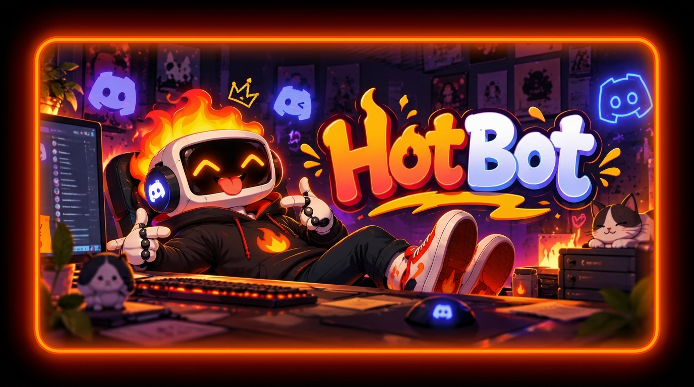

<div align="center">



<br><br>

### 🔥 Advanced Discord Music & Utility Bot

[](https://discord.com)
[](https://python.org)
[](LICENSE)

*High-quality music playback • Hotline playlists • Smart VC announcer • 24/7 Cloud hosting*

</div>

---

## 🌟 Core Features

### 🎵 Advanced Music Engine
- **High-Quality Playback:** Stream directly from YouTube and SoundCloud.
- **Playlist Support:** Paste a public YouTube/SoundCloud playlist URL, and it will instantly extract and queue all the songs!
- **Hotline System:** Create custom saved playlists assigned to a "Hotline" number (e.g., `!create_hotline 069 <songs>`). Dial the hotline (`!play 069`) to queue them all instantly.
- **JIT Extraction:** Stream URLs are generated Just-In-Time (JIT) right before the song plays, meaning your URLs will **never** expire, even in 500-song queues!
- **Pause & Resume:** Pause the music with `!pause` and pick up right where you left off with `!resume`.

### 🔊 Smart VC Announcer
- **Join Announcements:** Posts a message (e.g., `🔊 Anish joined General Voice`) into a specific text channel.
- **Auto-Join:** If a user joins a specific configured Voice Channel, the bot will automatically jump in behind them!
- **Privacy Controls:** The bot will automatically remain silent if the user joins a Private Voice Channel, or if the user is wearing a configurable "Silent Role".

### ☁️ Free 24/7 Cloud Hosting
- Includes a built-in Flask `keep_alive.py` web server. You can host this bot 100% for free on services like Render combined with UptimeRobot so it never sleeps! (See `HOSTING_GUIDE.md` for full instructions).

---

## 🚀 Setup & Installation

### 1. Discord Developer Portal setup
1. Go to https://discord.com/developers/applications and create your bot application.
2. Under **Bot**, enable these three **Privileged Gateway Intents**:
   - Message Content Intent
   - Server Members Intent
   - Presence Intent
3. Copy the bot token (Bot page → Reset Token / Copy).
4. Invite the bot to your server with at least these permissions: View Channels, Send Messages, Connect, Speak.

### 2. Local setup (macOS / Linux)
```bash
# from inside the bot folder
python3 -m venv venv
source venv/bin/activate
pip install -r requirements.txt

# FFmpeg is required for audio playback!
brew install ffmpeg  # macOS
# sudo apt install ffmpeg (Ubuntu/Linux)
```

Create a `.env` file in the root folder and paste in your token:
```bash
DISCORD_TOKEN=your_secret_token_here
```

### 3. Configuration
Open `cogs/vc_announcer.py` to customize the bot for your server:
- `ANNOUNCE_CHANNEL_ID`: Set this to the text channel where join announcements should be posted.
- `SPECIAL_ROLE_ID`: Users with this Role ID will bypass announcements (ghost mode).
- Look for `1553484183341637734` on line 57 if you want to change the VC that triggers the Auto-Join feature!

### 4. Run it
```bash
python bot.py
```

---

## ⌨️ Commands

| Command | What it does | Example |
| :--- | :--- | :--- |
| `!join` | Makes the bot join your Voice Channel | `!join` |
| `!play <query>` | Searches/queues a track, playlist, or dials a hotline | `!play lofi hip hop`<br>`!play 069` |
| `!pause` | Pauses the currently playing track | `!pause` |
| `!resume` | Resumes from where you paused | `!resume` |
| `!skip` | Skips the currently playing track | `!skip` |
| `!stop` | Clears the queue and leaves the VC | `!stop` |
| `!queue` | Shows the next 10 songs in the queue | `!queue` |
| `!create_hotline <no> <songs>` | Saves a custom playlist to a hotline number! | `!create_hotline 100 never gonna give you up, sandstorm` |

---

*Check out `HOSTING_GUIDE.md` to learn how to keep the bot online 24/7 for free!*
